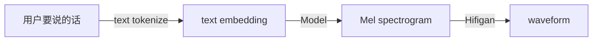
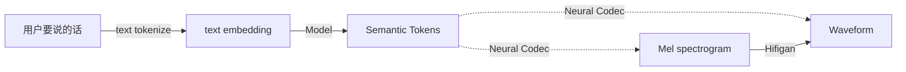

# Streaming input TTS

## 0. 简介

做出一个edge, streaming input, and performant TTS model的计划草图，骨干网络使用RWKV。该模型希望满足以下特点：

- Edge：参数量控制在1B以下。
- Streaming input：支持来自其他模型的流式输入，让首字到达-首帧声音输出的间隔尽可能缩短。
- Performant：声音好听，功能强大，其中功能列表如下：

| 功能特点   | 低阶                                                | 高阶                                         |
| ---------- | --------------------------------------------------- | -------------------------------------------- |
| 多音色     | 通过预设的或当场输入的speaker embedding实现多种音色 | 通过一段几秒钟的音频复制一个人的音色         |
| 情感可控   | 通过预设的emotion embedding实现有层次的情感输出     | 通过文字上的标签、或者参考音频，复制情感渲染 |
| 副语言现象 |                                                     | 支持咳嗽、笑、停顿等副语言现象               |

## 1. Streaming Input为什么很重要

1. 当前的绝大多数模型都进化了好几代，声音越来越好听，越来越真。但是它们都无法支持流式。Cartesia Sonic是唯一一个。他们也是基于RNN，或者说基于状态的模型。

2. 在不支持流式的情况下，类似豆包（直到目前仍然是这样的，但是以后会换）这样的伪双工产品使用的策略就是每次输出到一个句号的时候，发送一个tts调用。然后控制回答的开头为100种可能，这一句使用缓存。后续的句子每次到一个可以稳定朗读的时候就发送到TTS模型中，通常稳定朗读都是靠标点符号划分的出来的text chunk。

   ```mermaid
   sequenceDiagram
       participant Client as 客户端
       participant Server as 任何LLM
       participant TTS as 任何TTS服务
   
       Client->>Server: 流式TTS是怎么做的？
       note right of Server: 收到prompt，开始生成
       Server-->>Client: 这个问题很有趣.wav
       note left of Server: 特定的开头话术，调用缓存
       note left of Client: 听到第一句话的声音
       Server-->>TTS: 流式的TTS……（后续答案）
       note right of Server: 每个句号结束发送一次
       TTS->>Client: 句子1.wav
       TTS->>Client: 句子2.wav
       TTS->>Client: 句子3.wav
   ```
   
   3. 而类似GLM-4-voice这样的模型，其语音生成的模式则不太一样，基座模型会交替地生成语音token和文本token
   
      ```mermaid
      sequenceDiagram
          participant Client as 客户端
          participant Server as GLM-4-Voice
          participant TTS as Decoder
      
          Client->>Server: 流式TTS是怎么做的？
          note right of Server: 收到prompt，开始生成
          Server-->>Client: 这|个|问|题|很
          Server-->>TTS: 1,950,23,523,64,73,453,884
          TTS->>Client: 第一段语音.wav
          Server-->>Client: 有|趣|流|式|的
          Server-->>TTS: 242,....,640
          TTS->>Client: 第二段语音.wav
      ```
   
   4. （3）的方案需要改造基座模型，绝大多数人没有这个能力，而且本质上让基座GLM变得难以微调（你需要准备QA pair+声音的triplet才可以微调了）。（2）的方案已经有成熟的做法了，产品力强一点的公司能做到用户无感（例如豆包）。
   
   5. 同时单纯只做端侧的古典主义TTS也没意义，打不过kokoro，vits之流。
   
   总结一下：
   
   - Kokoro + LLM 难听，可以端侧，可以微调
   - CosyVoice + LLM 好听，无法端侧，可以微调
   - GLM-4-voice 好听，无法端侧，无法微调
   
   所以如果能像Cartesia Sonic一样做出来一个支持流式的TTS API，其他LLM服务商无论是包R1或者自己的LLM，都可以直接调用，降低延时，那还是有点意义的。
   
   Cartesia Sonic支持这样的模式：
   
   ```mermaid
   sequenceDiagram
       participant Client as 客户端
       participant Server as 任何LLM
       participant TTS as Cartesia
   
       Client->>Server: 流式TTS是怎么做的？
       note right of Server: 收到prompt，生成结果流式发送
       Server-->>TTS: 这|个
       TTS->>Client: 这个.wav
       Server-->>TTS: 问|题
       TTS-->>Client: 问题.wav
       Server-->>TTS: 有|趣
       TTS-->>Client: 有趣.wav
   ```
   
   

## 2. 那如何实现Streaming Input

### 2.1 TTS模型是如何发出声音的

声音是一个一维向量[time(秒数)*SR(码率), 1]。而这个波形信号信息密度是很低的（一大堆正弦波的加和），但是码率SR又很高（一秒钟一万到四万个值），不太方便一个模型直接输出。所以通常会有一个中间的表征是二维的，[time * N, D]，像是一句话的词向量拼接在一起一样。通常，10 < N < 50, 256 < D < 8192。

这种形态表征通常而言有两种，我们要加以区分。

- Melspectrogram，梅尔谱，单纯信号处理的产物（短时傅里叶变换）。声码器（vocoder）例如hifigan之类的，看到梅尔谱就能将原始声音复原出来。

  ```
  STFT(waveform) -> Mel
  Hifigan(Mel) -> waveform
  ```

- Semantic tokens，来自神经声码器(Neural Codec)的编码结果，可以做到离散化。encodec 就是这么个典型例子。简单地说，就是原始波形输入到encodec中，就会变成一个个独立的token id，通常一秒钟会产生 10 \* RVQ个token id ，RVQ一般是4或者8。将这些token id输入回去encodec，能解码出原始的音频。

以传统的tts模型为例，包括fastspeech, kokoro 之类：



现代一点的TTS模型，音质更好一些的，例如GPTSovits, cosyvoice之类，通过一个类似GPT一样的模型输入要朗读的文本的text tokens之后，通过不断decode生成出一串很长的semantic tokens。这些tokens会被神经声码器直接转换成波形，或者Mel谱。



### 2.2 流式的瓶颈在什么地方

我们通常而言可以认为流式的瓶颈并不在最后的二维表征变成一维声波的步骤，因为hifigan或者neural codecs 都有流式版本可以选择。瓶颈通常在主要的模型侧，即接受了文本token之后生成出二维表征的过程。

传统的模型做不到流式，有三个主要原因：

- 因为TTS模型需要看到整个用户输入（或尽可能大的ctx窗），才能精确地分配句子中单词的韵律(Prosody，平仄)，读出来好听。
- 同时，结构通常都是AE或者encode-decode模式，这种情况下，设计容易结构简单。
- 从工程上来说，以前并没有gpt这种打字机文本生成模式，朗读的内容都是定稿的，没有流式需求。就算现在有了GPT，只要RTF（实时率）小于一，非流式的TTS也能被界面设计的高水平掩盖过去（一句句话独立生成，只要你听完第一句之前，第二句来了，你就不会知道）

### 2.3 那我们打算怎么做

#### 2.3.1 Bare minimum

因为我们是第一次做TTS模型，最好的方法应该从bare minimum开始。BM开发有一个原则——懒：

- 能用预训练全用预训练，能不调的权重就不调，预训练模型有小的就不用大的。
- 能不加的模块就不加，能不写的loss就不写，能不支持的模式就不支持。

我们现在来定义最简单的bare minimum案例：

- 声码器直接用预训练模型。

- 一个人的声音（直接找个LJspeech里面的single speaker，或者Libri-TTS）
- 微调一个RWKV输出到声码器的码本上。

具体来说：

- 假设我们现在有同一个人说的十小时的录音和对应的文本。

- 我们就用一个声码器将录音直接转换成codebook ID，将文本转化成token ID

- 在已经预训练过的最小的RWKV里面加入一个全新的nn.Embedding，对应声码器的codebook。模型会变成这样：

  ```mermaid
  graph TD
  TextA["'Good day'"] -->A
  A[Text Embedding]
  AudioB["1,2,3,4"] -->B
  B[Audio Embedding]
  A -->|concat| Embedding
  B -->|concat| Embedding
  Embedding --> RWKV -->|"*12"| RWKV
  RWKV --> C[Next Audio Token: 5]
  ```

  

- token ID 当作Q，codebook ID当作A，SFT。假设输入的文本是`<BOS> Good <EOS>`, token_id = [1, 48, 29, 2]，对应语音的codebook ID = [485, 295, 1032, 329, 845]，则我们产生下面的训练数据：

  ```json
  [
      {"role": "user", "content": [1, 48, 29, 2]},
      {"role": "assistant", "content": [485, 295, 1032, 329, 845]}
  ]
  ```

  而在训练的时候，assistant的输出都用全新加入的nn.Embedding查表，原来用户的输入都用旧的Embedding查表。（等于额外增加了vocab），训练的时候，我们这样监督：

  ```
  RWKV([1, 48, 29, 2]) = 485
  RWKV([1, 48, 29, 2], [485]) = 295
  RWKV([1, 48, 29, 2], [485, 295]) = 1032
  RWKV([1, 48, 29, 2], [485, 295, 1032]) = 329
  RWKV([1, 48, 29, 2], [485, 295, 1032, 329]) = 845
  ...
  ```

  

产生的效果：

- 输入文本后RWKV可以对应地输出这个人说这句话的声音应有的码本，被声码器转变成波形。
- 这个波形会“毫无表现力”地将文字读出，甚至可能有错音。


#### 2.3.2 在这上面加入其他要素——大规模语音的预训练

大多数现代化的TTS能做出非常自然的声音，都是因为加入了对声码器码本的预训练。即：

- 我们可以大规模地用神经编码器编码音频成codebook id

- 在这些codebook id上完成next token prediction预训练

  - 以刚才的例子来说：训练一个模型

    ```
    RWKV([], [485, 295, 1032]) = 329
    RWKV([], [485, 295, 1032, 329]) = 845
    ...
    ```

  - 完成后，RWKV应该能在没有文字指导的情况下， 顺着一个输入的音频胡言乱语，发出人的声音，但不具备连贯语义。

- 再将文本到音频的生成问题当作在这个模型上进行instruction tuning.

  - 完成后，RWKV应该能在有文字指导的情况下，将这个文字精确无误地读出来。


这么做有两个好处：

- 自然的说话风格是从大规模数据上学习到的。而微调它只需要较少的数据。（原来2.3.1里面的全部数据，都只是现在的instruction tuning数据了，模型当然会好很多）
- 模型能立刻模仿多人、多风格说话。

```
RWKV([要说的话], [要参考的人的其他声音]) = [这个人说这句话的声音]
RWKV([要说的话], [要参考的情绪风格的其他声音]) = [这个情绪风格说这句话的声音]
```

### 2.4 可以借鉴的技术手法

- 将所有的文字都按照注音的方式输入有奇效。例如kokoro就是将所有的语言输入全部替换成国际音标IPA